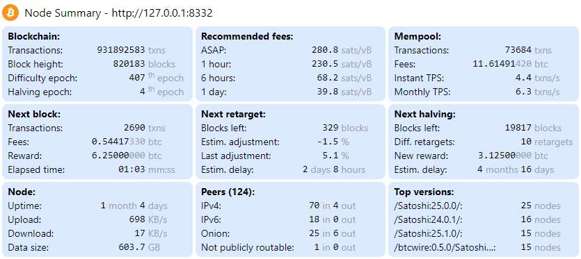

This is a [Next.js](https://nextjs.org/) project bootstrapped with [`create-next-app`](https://github.com/vercel/next.js/tree/canary/packages/create-next-app).

The Web App displays summary information about a Bitcoin Core node. It must be run directly on the same machine as the node and the node must be accessible with credentials in `.cookie` file.

The app has one web page (/) and one API entry point (/api/summary). The web page is automatically refreshed every 5 secondes. The refresh rate can be changed with REVALIDATE parameter in .env file. To not burden the bitcoin RPC, the API is cached and REVALIDATE parameter is also the API cache duration.

The information is divided in a set of cards spread on a grid. The grid uses Tailwind breakpoint prefixes and grid template columns so that the layout is responsive to the dynamic screen size and orientation.

Note: Any mention of 192.168.110.121 throughout the document should be replaced by your own address of deployment.

## Development

Adapt .env file at the root:
  - redefine BITCOIND_COOKIE_PATH to point to your bitcoin node `.cookie` file
  - set BITCOIND_PORT to your bitcoin RPC port.

Install the dependencies:
```bash
npm install
```

Run the development server:
```bash
npm run dev
```

Open [http://localhost:3003](http://localhost:3003) with your browser to see the result. To display formatted json API result run `curl localhost:3003/api/summary | jq -r '.'`

## Deployment

Build the web app with:
```bash
npm run build
```

Redefine `-H` option in `start` command of package.json to correspond to your exposed address (mine is `192.168.110.121` in my WireGuard VPN).

Allow 3003 port in your firewall. For UFW the command is `sudo ufw allow from 192.168.110.0/24 to any port 3003 proto tcp` (this is my VPN cidr)

Run the server with:
```bash
npm run start
```

Note that in both development and deployment cases the port used is the same (3003) but it's OK to run them in parallel on the same machine because they are defined on different interfaces (respectively, localhost and 192.168.110.121).

## Automatic launch with systemctl

Stop any interactive `npm run start` session.

Create `/etc/systemd/system/node-summary.service` file with following content (replace working directory, npm path, user, group by your own):
```ini
[Unit]
Description=BTC RPC Summary
After=bitcoind.service

[Service]
WorkingDirectory=/home/ubuntu0/Documents/node-summary/
# We need both setting the path (for node) and prefixing executed program (for npm)
ExecStart=bash -c "PATH=/home/ubuntu0/.nvm/versions/node/v18.14.2/bin:$PATH /home/ubuntu0/.nvm/versions/node/v18.14.2/bin/npm start"
User=ubuntu0
Group=ubuntu0
Type=simple
KillMode=control-group
TimeoutSec=60
Restart=always
RestartSec=60

[Install]
WantedBy=multi-user.target
```

Launch web app with:
```
sudo systemctl enable node-summary
sudo systemctl start node-summary
```

Access from browser by navigating to http://192.168.110.121:3003 or call API with `curl http://192.168.110.121:3003/api/summary | jq -r '.'`

Get the logs with: `journalctl -S <hh:mm> -u node-summary -o cat -f`

## Examples

### Web App screen shot



### API result

```json
{
  "feerates": {
    "1": 22,
    "6": 17,
    "144": 11
  },
  "uptime_days": 29.161,
  "diff_epoch": 396,
  "halving_epoch": 4,
  "blocks": 796706,
  "headers": 796706,
  "size_on_disk": 558921305562,
  "totalbytesrecv": 22671844123,
  "totalbytessent": 153581916331,
  "peers": {
    "total": 70,
    "ipv4": 10,
    "ipv6": 0,
    "onion": 59,
    "not_publicly_routable": 1
  },
  "sub_versions": [
    [ "/Satoshi:25.0.0/", 18 ],
    [ "/Satoshi:24.0.1/", 17 ],
    [ "/Satoshi:23.0.0/", 12 ],
    [ "/Satoshi:22.0.0/", 4 ],
    [ "/Satoshi:24.0.0/", 2 ],
    [ "/Satoshi:0.21.0/", 2 ],
    [ "/Satoshi:23.0.0/Knots:20220529/", 2 ],
    [ "/bitcoinj:0.14.3/Bitcoin Wallet:4.58/", 2 ],
    [ "/electrs:0.9.13/", 1 ],
    [ "", 1 ],
    [ "/Satoshi:24.0.1(Samourai Dojo 1.19.2)/", 1 ],
    [ "/Satoshi:24.1.0/", 1 ],
    [ "/btcwire:0.5.0/:/", 1 ],
    [ "/Satoshi:23.0.0(RoninDojo 1.18.1)/", 1 ],
    [ "/Satoshi:0.16.99/", 1 ],
    [ "/bitcoinj:0.14.4/Bitcoin Wallet:5.26/", 1 ],
    [ "/bitcoinj:0.14.5/Bitcoin Wallet:5.45/", 1 ],
    [ "/Satoshi:0.15.0.1(No2X)/", 1 ],
    [ "/breadwallet:0.6.8/", 1 ]
  ],
  "template": {
    "fees": 0.18190531,
    "ntx": 2519
  },
  "mempool": {
    "fees": 4.05394828,
    "ntx": 117648,
    "ntx_per_second": 3.081
  },
  "time_since_last_bloc": 408,
  "prev_diff_adj_percent": -3.255,
  "next_retarget": {
    "blocks": 1630,
    "days": 10.971,
    "estimated_diff_adj_percent": 3.176
  },
  "next_halving": {
    "blocks": 43294,
    "retargets": 21,
    "days": 300.653
  },
  "revalidate": "5"
}
```
