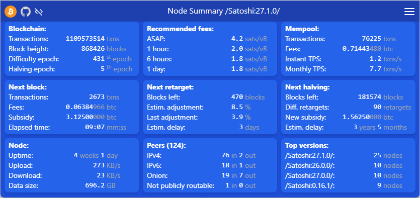

This is a [Next.js](https://nextjs.org/) project bootstrapped with [`create-next-app`](https://github.com/vercel/next.js/tree/canary/packages/create-next-app).

The Web App displays summary information about a Bitcoin Core node. It exclusively uses the bitcoin RPC API to get this information.

The app has one web page (/) and one main API entry point (/api/summary). The web page is periodically refreshed. The refresh rate can be changed in the settings form. Possible rates are multiple values of the bitcoin node cache duration (REVALIDATE parameter in .env file). The settings form also allows to switch between light and dark mode.

There is also a health check API entry point (/api/health) that returns either 200 OK or 503 Service Unavailable.

The information is divided in a set of cards spread on a grid. The grid uses Tailwind breakpoint prefixes and grid template columns so that the layout is responsive to the dynamic screen size and orientation.

The web page is still operational when javascript is disabled on browser because all pages are rendered on server. To achieve this result:
- automatic refresh is managed by http-equiv="refresh" meta tag
- settings form UI is entirely managed in CSS

Note: Any mention of 192.168.110.121 throughout the document should be replaced by your own address of deployment.

## Development

Adapt .env file at the root:
  - set REVALIDATE to the desired refresh rate value (in seconds)
  - set BITCOIND_HOST to your bitcoin RPC host (including the scheme)
  - set BITCOIND_PORT to your bitcoin RPC port
  - use one of 3 authentication methods:
    - define BITCOIND_COOKIE_PATH to point to your bitcoin node `.cookie` file (when server is run directly on the same machine as the node)
    - set BITCOIND_USERNAME and BITCOIND_PASSWORD environment variables
    - don't set any of BITCOIND_COOKIE_PATH, BITCOIND_USERNAME and BITCOIND_PASSWORD environment variables for an unauthenticated server (like https://bitcoin-mainnet-archive.allthatnode.com:443 for example)
  - set TIMINGS_LEVEL to define logging of fetch requests duration:
    - 0 or absent: no logging
    - 1: logging when batch duration is > 3 seconds
    - 2: unconditional logging

Install the dependencies:
```bash
npm install
```

Run the development server:
```bash
npm run dev
```

Open [http://localhost:3003](http://localhost:3003) with your browser to see the result. To display formatted json API result run `curl localhost:3003/api/summary | jq -r '.'`

## Deployment

If configuration is different from development, then create a `.env.production.local` file to adapt environment variables. If this file contains secrets don't publish it to GitHub (default NextJS generated configuration exclude it in .gitignore file). Example of such a file:
```ini
# New environment variables
BITCOIND_USERNAME="<redacted>"
BITCOIND_PASSWORD="<redacted>"
# Erase BITCOIND_COOKIE_PATH defined in .env file
BITCOIND_COOKIE_PATH=
# Overwrite BITCOIND_HOST defined in .env file
BITCOIND_HOST="http://192.168.110.121"
# Log fetch timings when batch duration is > 3 seconds
TIMINGS_LEVEL=1
```

Build the web app with:
```bash
npm run build
```

Redefine `-H` option in `start` command of package.json to correspond to NextJS app exposed address. This address can be different from bitcoind host.

Allow 3003 port in your firewall. For UFW the command is `sudo ufw allow from 192.168.110.0/24 to any port 3003 proto tcp` (this is my VPN cidr)

Run the server with:
```bash
npm run start
```

Note that in both development and deployment cases the port used is the same (3003) but it's OK to run them in parallel on the same machine because they are defined on different interfaces (respectively, localhost and 192.168.110.121).

## Automatic launch with systemctl

Stop any interactive `npm run start` session.

Create `/etc/systemd/system/node-summary.service` file with following content (replace working directory, npm path, user, group by your own):
```ini
[Unit]
Description=BTC RPC Summary
After=bitcoind.service

[Service]
WorkingDirectory=/home/ubuntu0/Documents/node-summary/
# We need both setting the path (for node) and prefixing executed program (for npm)
ExecStart=bash -c "PATH=/home/ubuntu0/.nvm/versions/node/v20.11.0/bin:$PATH /home/ubuntu0/.nvm/versions/node/v20.11.0/bin/npm start"
User=ubuntu0
Group=ubuntu0
Type=simple
KillMode=control-group
TimeoutSec=60
Restart=always
RestartSec=60

[Install]
WantedBy=multi-user.target
```

Launch web app with:
```
sudo systemctl enable node-summary
sudo systemctl start node-summary
```

Access from browser by navigating to http://192.168.110.121:3003 or call API with `curl http://192.168.110.121:3003/api/summary | jq -r '.'`

Get the logs with: `journalctl -S <hh:mm> -u node-summary -o cat -f`

## Web App screen shot example


